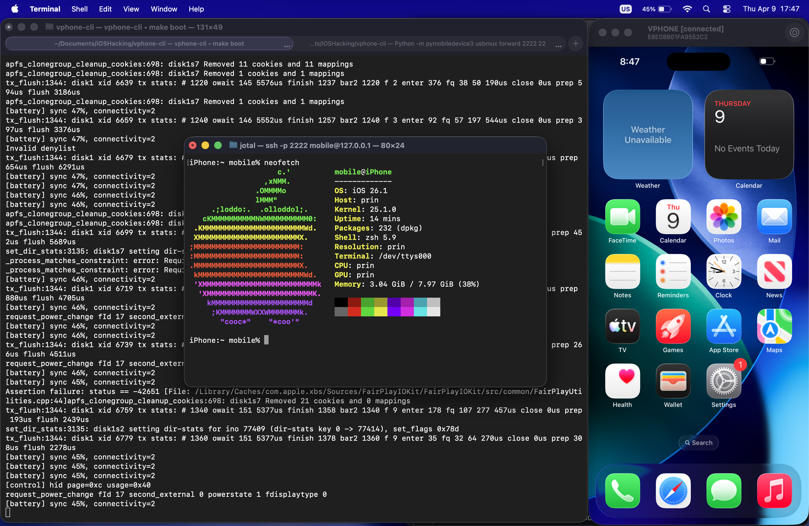

For this first post about getting started in iOS security research, we will take advantage of the vphone-cli project in order to run a fully virtualized iPhone on top of apple silicon chips, and set up some useful tools for security research.

> Note: To follow the steps described in this post, you will need access to an Apple machine with an Apple Silicon processor, otherwise you won't be able to set up the environment. All the steps described below have been executed in the MacBook Air M2 2022 platform.


## Obtaining a virtual device using `vphone-cli`

[vphone-cli](https://github.com/Lakr233/vphone-cli) is an open-source project that enables you to boot a virtual iPhone (iOS 26) via Apple's Virtualization.framework, taking advantage of Apple's Private Cloud Compute research VM infrastructure.

You can find the complete installation guide in the project README file. In this section I will share how I installed it myself and how I troubleshooted some of the installation issues.

For the SIP configuration I decided to go with Option 2: Keep SIP mostly enabled, disable only debug restrictions + `make amfidont_allow_vphone`

### Manual Setup

`make setup_tools`: This first step required a higher python version than the one installed by default in my macOS, so I installed python@3.14 via homebrew and manually created (`python3.14 -m venv .venv`) and activated (`source .venv/bin/activate`) the environment before running make with the `setup_tools` target.

`make build`: No changes needed -> `build` target was already executed before (for `amfidont_allow_phone` if I'm not wrong).

`make vm_new`: No comments.

`make fw_prepare`: Somewhat long wait ahead: ~10GiB download.

```
*** Download Progress Summary as of .. 2026 ***
========================================================================================
[#d65d10 752MiB/10GiB(7%) CN:16 DL:4.9MiB ETA:32m1s]
FILE: /Users/../iOSHacking/vphone-cli/scripts/../ipsws/iPhone17,3_26.1_23B85_Restore.ipsw
----------------------------------------------------------------------------------------

[#d65d10 0.9GiB/10GiB(9%) CN:16 DL:4.6MiB ETA:33m2s]

(...)

==> Done. Restore directory ready: iPhone17,3_26.1_23B85_Restore/
    Run 'make fw_patch' to patch boot-chain components.
```

`make fw_patch_jb`: Select the jailbroken variant :)

```
(...)

============================================================
  All 7 components patched successfully! (154 total patches)
============================================================
[patch-firmware] applied 154 patches for jb
```

We cannot boot yet, we need to follow the restoration and firmware installation steps.

> Note: remember to run `make amfidont_allow_vphone` after each reboot, or at some point the execution will fail.

### Restore

As described in the original [README.md](https://github.com/Lakr233/vphone-cli/blob/main/README.md) file for the vphone-cli project, we will need two terminals to proceed with the restore process. In terminal 1 we will run `make boot_dfu` to boot the VM in DFU mode and leave it running, then in terminal 2 we will run `make restore_get_shsh` to fetch the SHSH blob and `make restore` to flash the firmware via pymobiledevice3 restore.

Command execution overview:

| Terminal 1 | Terminal 2 |
|------------|------------|
| `make boot_dfu` |  |
| (running) | `make restore_get_shsh` |
| (running) | `make restore` |

> Note: when both commands in terminal 2 get executed we will see a panic stacktrace in terminal 1, which is completely fine.

### Install Custom Firmware

For the restore process we will need to use three terminals. In terminal 1 we will need to kill the DFU boot and then boot into DFU again with `make boot_dfu` and leave it running. Then, in terminal 2 we will run `sudo make ramdisk_build` to build the signed SSH ramdisk followed by `make ramdisk_send` to send it to the device. If this latest step succeeds we will be prompted with the following banner in terminal 1:

```
(...)
USB init done
llllllllllllllllllllllllllllllllllllllllllllllllll
llllllllllllllllllllllllllllllllllllllllllllllllll
lllllc:;;;;;;;;;;;;;;;;;;;;;;;;;;;;;;;;;;;;:clllll
lllll,.                                    .,lllll
lllll,                                      ,lllll
lllll,                                      ,lllll
lllll,      '::::,             .,::::.      ,lllll
lllll,      ,llll;             .:llll'      ,lllll
lllll,      ,llll;             .:llll'      ,lllll
lllll,      ,llll;             .:llll'      ,lllll
lllll,      ,llll;             .:llll'      ,lllll
lllll,      ,cccc,             .;cccc'      ,lllll
lllll,       ....               .....       ,lllll
lllll,                                      ,lllll
lllll,                                      ,lllll
lllll,            .''''''''''''.            ,lllll
lllll,            ,llllllllllll,            ,lllll
lllll,            ,llllllllllll,            ,lllll
lllll,            ..............            ,lllll
lllll,                                      ,lllll
lllll,                                      ,lllll
lllll:'....................................':lllll
llllllllllllllllllllllllllllllllllllllllllllllllll
llllllllllllllllllllllllllllllllllllllllllllllllll
llllllllllllllllllllllllllllllllllllllllllllllllll
SSHRD_Script by Nathan (verygenericname)
Running server
```

With the ramdisk running, we will execute `python3 -m pymobiledevice3 usbmux forward 2222 22` in terminal 3 for the usbmux tunnel (remember to activate the python3 virtual env for this), then switch to terminal 2 again and run `make cfw_install_jb` (remember we're using the jailbroken variant, therefore we use the `_jb` suffix) to install CFW. This will take some time, especially `Copying Cryptexes to device (this takes ~3 minutes)...` in my case.
```
(...)

[*] Unmounting device filesystems...
[*] Cleaning up temp binaries...

[+] CFW + JB installation complete!
    Reboot the device for changes to take effect.
    After boot, SSH will be available on port 22222 (password: alpine)
```

> Note: remember to install the Xcode developer tools from the App Store or your installation will fail. You will (sadly) need to create an Apple Account for this purpose.

Command execution overview:

| Terminal 1 | Terminal 2 | Terminal 3 |
|------------|------------|------------|
| `make boot_dfu` |  |  |
| (running) | `sudo make ramdisk_build` |  |
| (running) | `make ramdisk_send` |  |
| (running) |  | `python3 -m pymobiledevice3 usbmux forward 2222 22` |
| (running) | `make cfw_install_jb` | (running) |

### Booting

We can now finally boot into our virtualized iPhone device by running `make boot` (after making sure that DFU boot is no longer running).

As stated in the project README, do not select Japan or European Union as your region during iOS setup. It might cause conflict with system apps due to regulatory checks. US region works fine for me.

### SSH Configuration

To connect via SSH we first install the `openssh-server` package from Sileo (comes already preinstalled in the jb variant), we reboot the phone and then start the usbmux forward tunnel:
```shell
python3 -m pymobiledevice3 usbmux forward 2222 22
```

We can now finally get an ssh connection to our device: (password: `alpine`)
```shell
ssh -p 2222 mobile@127.0.0.1 
```




## Setting up the research tools

In order to solve some simple lab exercises, we will user `radare2` to reverse engineer the binaries and find where the vulnerabilities are located, and `lldb` to analyze the process memory and execution flow.  

### radare2

[radare2](https://github.com/radareorg/radare2) is a free/libre toolchain for easing several low level tasks like forensics, software reverse engineering, exploiting, debugging, ... It is composed by a bunch of libraries (which are extended with plugins) and programs that can be automated with almost any programming language. (source: https://www.radare.org/n/radare2.html)

Despite the developers recommendation to install it from git, I tend to get `radare2` from Homebrew by running:
```shell
brew install radare2
```
I also like to have the Native Ghidra Decompiler for r2 plugin, [r2ghidra](https://github.com/radareorg/r2ghidra) installed just in case:
```shell
r2pm -U
r2pm -ci r2ghidra
```

### LLDB 

[LLDB](https://github.com/llvm/llvm-project) is a next generation, high-performance debugger. It is built as a set of reusable components which highly leverage existing libraries in the larger LLVM Project, such as the Clang expression parser and LLVM disassembler. It is the default debugger in Xcode on macOS and supports debugging C, Objective-C and C++ on the desktop and iOS devices and simulator. (source: https://lldb.llvm.org/)

LLDB comes already preinstalled in macOS for the reasons described above, but I also like to use the LLEF plugin (the LLDB equivalent of GDB's gef/peda/pwndbg), which can be installed by simply cloning the repo and running the installation script:
```shell
git clone https://github.com/foundryzero/llef
cd llef
./install.sh
```

In the following post we will start solving some simple but interesting challenges :)

